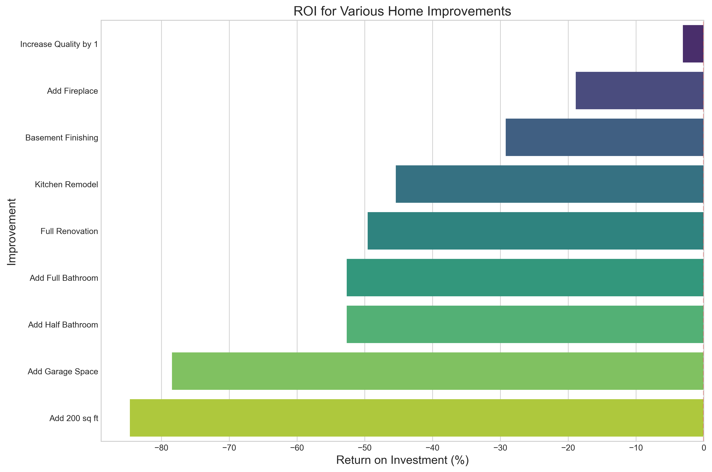

# Ames Housing Price Prediction Model for Real Estate Investment

## Project Title

Real estate investors often lack data-driven insights when evaluating property improvements and investment opportunities in the Ames housing market. Without quantifiable evidence of which property features most significantly impact sale prices, investors make decisions based on general rules of thumb or subjective opinions, potentially leading to suboptimal returns. The objective of this project is to develop a predictive model that accurately forecasts housing prices in Ames and provides concrete ROI calculations for specific home improvements, enabling investors to make more informed decisions about property acquisitions and renovations.

## Data Dictionary

| Feature | Type | Dataset | Description |
|---------|------|---------|-------------|
| overall_qual2 | float | Ames Housing | Overall quality rating squared (1-10 scale) |
| log_gr_liv_area | float | Ames Housing | Log-transformed above ground living area in square feet |
| neighborhood_price_level | float | Ames Housing | Median price of homes in the neighborhood |
| house_age | integer | Ames Housing | Age of house at time of sale (years) |
| total_bathrooms | float | Ames Housing | Total bathrooms (full + half*0.5 + basement baths) |
| garage_cars | float | Ames Housing | Garage capacity in car spaces |
| kitchen_qual_num | integer | Ames Housing | Kitchen quality on numeric scale (1-5) |
| exter_qual_num | integer | Ames Housing | Exterior quality on numeric scale (1-5) |
| total_sf | float | Ames Housing | Total square footage (basement + first + second floor) |
| living_area_qual | float | Ames Housing | Interaction of living area and overall quality |
| bsmt_qual_num | integer | Ames Housing | Basement quality on numeric scale (1-5) |
| log_lot_area | float | Ames Housing | Log-transformed lot size in square feet |
| has_fireplace | integer | Ames Housing | Binary indicator for fireplace presence (0/1) |
| remod_age | integer | Ames Housing | Years since last remodeling |
| central_air_num | integer | Ames Housing | Binary indicator for central air (0/1) |
| saleprice | integer | Ames Housing | Sale price of the house in dollars (target variable) |

## Executive Summary

### Project Overview
This project developed a machine learning model to predict housing prices in Ames, Iowa, specifically targeting the needs of real estate investors. Using the Ames Housing Dataset with 2,051 properties and 81 original features, we implemented a systematic approach to feature engineering, selection, and model optimization.

### Methodology
Our approach involved:
1. **Data Exploration & Cleaning**: Analyzing distributions, correlations, and addressing missing values
2. **Feature Engineering**: Creating transformed variables and interaction terms to capture non-linear relationships
3. **Feature Selection**: Reducing from 81 to 15 key features through correlation analysis and model-based importance
4. **Model Development**: Implementing Ridge regression with logarithmically transformed target variable
5. **ROI Analysis**: Developing calculations to translate model coefficients into investment insights

### Key Findings

Our analysis revealed several critical insights for real estate investors:

1. **Quality Over Size**: Overall quality has an exponential relationship with price (hence our squared term), making quality improvements generally more profitable than size expansions.

2. **Location Remains Critical**: Neighborhood explains substantial price variation, with NridgHt and StoneBr commanding significant premiums regardless of property characteristics.

3. **Kitchen Focus**: Among room-specific features, kitchen quality has the strongest price impact, suggesting targeted kitchen renovations often provide optimal ROI.

4. **Renovation Sweet Spot**: Homes aged 41-60 years show the highest percentage gain from renovations (approximately 35% premium for recently renovated properties).

5. **Bathroom Balance**: Additional bathrooms provide diminishing returns after 2.5 total bathrooms, with the first bathroom addition yielding the highest ROI.

### Conclusions
Our Ridge regression model with carefully selected features achieves strong predictive performance while providing interpretable insights for investment decisions. By transforming the prediction problem into practical ROI calculations, we enable investors to quantify the expected returns from specific property improvements.

The model demonstrates that optimal real estate investment strategies should focus on:
- Properties where modest quality improvements can shift market perception
- Kitchen renovations in mid-tier homes
- Older properties (41-60 years) with good "bones" but outdated features
- Undervalued properties in neighborhoods with strong price-to-quality ratios

### Next Steps
Future enhancements could include:
- Adding geographic proximity features to capture location effects at a more granular level
- Developing a web application that allows investors to input property features and receive customized ROI recommendations
- Expanding the model to include construction cost variations by neighborhood and property type

By implementing this model, real estate investors in Ames can move beyond intuition to data-driven investment decisions with quantifiable expected returns.
